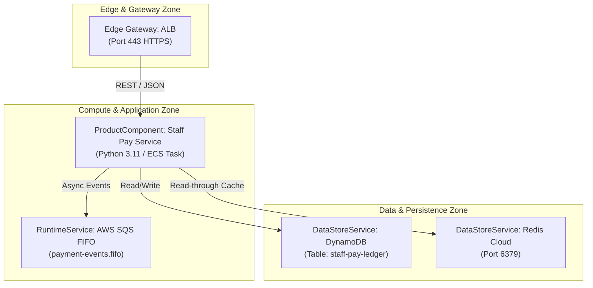

# Draftsman Architecture Diagramming Skill

## Purpose
Enables the Draftsman Agent to parse DRAFT catalog YAML objects (`software_deployment_pattern`, `product_component`, `runtime_service`, `data_store_service`, `edge_gateway_service`) and render visual architectural diagrams in standard Mermaid.js markdown syntax.

## Supported Diagram Types

1. **Deployment Topology Flowchart (`flowchart TD / LR`)**:
   - Visualizes network zone boundaries (Edge, App Zone, Data Zone).
   - Shows connections between gateways, compute runtimes, queues, and databases.
2. **Service Interaction Sequence Diagram (`sequenceDiagram`)**:
   - Visualizes request/response flows between microservices, messaging queues, and data stores.
3. **Component Architecture Diagram (C4 Component)**:
   - Displays internal interfaces, exposed APIs, and technology stack choices for a single `product_component`.

---

## Diagram Generation Rules

1. **Always Use Standard Mermaid Syntax**:
   - Wrap output in triple backticks with language identifier `mermaid`.
   - Quote node labels containing special characters: `id["API Gateway (Port 443)"]`.
2. **Represent Network Subgraph Boundaries**:
   - Use `subgraph` blocks to visually segregate network zones:
     - `subgraph Edge ["Edge / Boundary Zone"]`
     - `subgraph Application ["Compute & Runtime Zone"]`
     - `subgraph Data ["Data & Storage Zone"]`
3. **Include Key Technical Details**:
   - Label arrows with protocols/ports: `ALB -->|HTTPS :443| ServiceA`
   - Indicate data direction: `ServiceA -->|Write / TLS| DynamoDB`

---

## Example Mermaid Output

