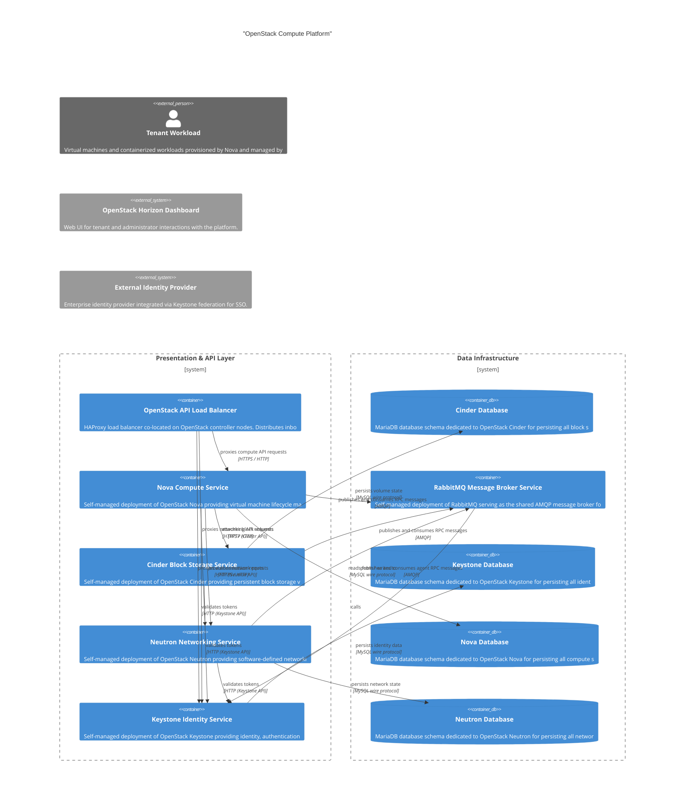

```mermaid
C4Container
    title "OpenStack Compute Platform"

    Person_Ext(Tenant_Workload, "Tenant Workload", "Virtual machines and containerized workloads provisioned by Nova and managed by ")
    System_Ext(OpenStack_Horizon_Dashboard, "OpenStack Horizon Dashboard", "Web UI for tenant and administrator interactions with the platform.")
    System_Ext(External_Identity_Provider, "External Identity Provider", "Enterprise identity provider integrated via Keystone federation for SSO.")

    Boundary(b0, "Presentation & API Layer") {
        Container(01KSF29JTP_9HYA, "OpenStack API Load Balancer", "", "HAProxy load balancer co-located on OpenStack controller nodes. Distributes inbo")
        Container(STCK000001_RS01, "Nova Compute Service", "", "Self-managed deployment of OpenStack Nova providing virtual machine lifecycle ma")
        Container(STCK000005_RS05, "Cinder Block Storage Service", "", "Self-managed deployment of OpenStack Cinder providing persistent block storage v")
        Container(STCK000004_RS04, "Neutron Networking Service", "", "Self-managed deployment of OpenStack Neutron providing software-defined networki")
        Container(STCK000002_RS02, "Keystone Identity Service", "", "Self-managed deployment of OpenStack Keystone providing identity, authentication")
    }

    Boundary(b1, "Data Infrastructure") {
        ContainerDb(STCK000005_DAR5, "Cinder Database", "", "MariaDB database schema dedicated to OpenStack Cinder for persisting all block s")
        Container(STCK00000D_RS0D, "RabbitMQ Message Broker Service", "", "Self-managed deployment of RabbitMQ serving as the shared AMQP message broker fo")
        ContainerDb(STCK000002_DAR2, "Keystone Database", "", "MariaDB database schema dedicated to OpenStack Keystone for persisting all ident")
        ContainerDb(STCK000001_DAR1, "Nova Database", "", "MariaDB database schema dedicated to OpenStack Nova for persisting all compute s")
        ContainerDb(STCK000004_DAR4, "Neutron Database", "", "MariaDB database schema dedicated to OpenStack Neutron for persisting all networ")
    }

    Rel(01KSF29JTP_9HYA, STCK000002_RS02, "proxies authentication requests", "HTTPS / HTTP")
    Rel(01KSF29JTP_9HYA, STCK000004_RS04, "proxies networking API requests", "HTTPS / HTTP")
    Rel(01KSF29JTP_9HYA, STCK000001_RS01, "proxies compute API requests", "HTTPS / HTTP")
    Rel(STCK000005_RS05, STCK000002_RS02, "validates tokens", "HTTP (Keystone API)")
    Rel(STCK000005_RS05, STCK00000D_RS0D, "publishes and consumes RPC messages", "AMQP")
    Rel(STCK000005_RS05, STCK000005_DAR5, "persists volume state", "MySQL wire protocol")
    Rel(STCK000002_RS02, STCK000002_DAR2, "persists identity data", "MySQL wire protocol")
    Rel(STCK000004_RS04, STCK000002_RS02, "validates tokens", "HTTP (Keystone API)")
    Rel(STCK000004_RS04, STCK00000D_RS0D, "publishes and consumes agent RPC messages", "AMQP")
    Rel(STCK000004_RS04, STCK000004_DAR4, "persists network state", "MySQL wire protocol")
    Rel(STCK000001_RS01, STCK000005_RS05, "attaches block volumes", "HTTP (Cinder API)")
    Rel(STCK000001_RS01, STCK000002_RS02, "validates tokens", "HTTP (Keystone API)")
    Rel(STCK000001_RS01, STCK00000D_RS0D, "publishes and consumes RPC messages", "AMQP")
    Rel(STCK000001_RS01, STCK000004_RS04, "provisions network ports", "HTTP (Neutron API)")
    Rel(STCK000001_RS01, STCK000001_DAR1, "reads from / writes to", "MySQL wire protocol")
    Rel(STCK00000D_RS0D, STCK000002_RS02, "calls")
```