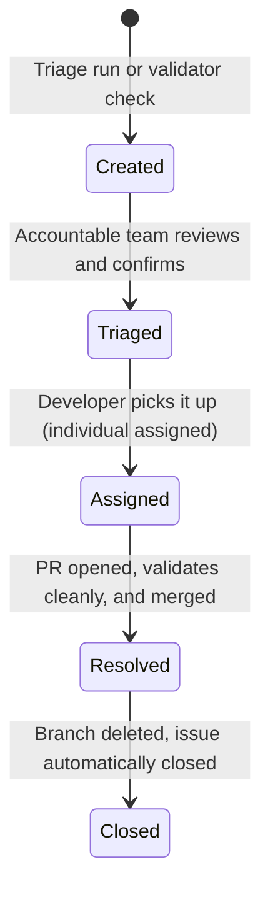

# Draft Operations Guide

> **Audience:** Draft Admins, Shared Services, and Engineering Representatives.
> This guide defines the governance, ticketing, team ownership, and review workflows for a DRAFT workspace.
> It serves as the authoritative operational standard for how a company runs DRAFT day-to-day.

---

## 1. Purpose

The Draft Operations Guide defines how Draft work is routed, reviewed, ticketed, triaged, assigned, and closed in a Git-based company workspace.

This guide does **not** replace object modeling documents, schema reference files, or onboarding tutorials. Instead, it references those resources where appropriate and focuses strictly on operating policy, lifecycle norms, and team workflows.

---

## 2. Operating Principles

DRAFT operations are guided by five core principles:
* **DRAFT work is Git-native:** All workspace changes, catalog definitions, and reviews occur via standard Git commits, branches, and pull requests.
* **YAML is the single source of truth:** All architecture facts, governance criteria, and metadata live in declarative YAML files. Downstream displays, boards, or wikis are derived, never the authoring source.
* **DRAFT routes work to teams; teams assign people:** DRAFT issues and CODEOWNERS reviews are assigned to structural teams (via GitHub teams), not individuals. Individual assignment only happens when someone is actively coding.
* **Folder structure organizes content; YAML owns accountability:** Folders categorize the architectural layers (`engineering/`, `shared-services/`, and `governance/`) by their content role. Concrete team accountability lives inside the YAML artifacts (`owner.team`).
* **CODEOWNERS is generated from governed team vocabulary:** Git-level review routing is programmatically generated from the team registry and artifact metadata, removing manual coordination overhead.

---

## 3. Roles

DRAFT recognizes three operational roles. Each owns a distinct layer of the catalog and configurations:
* **Engineering:** Owns and authors application and product architecture. This includes `ProductComponent`, `DataComponent`, and `SoftwareDeploymentPattern` (SDP) objects. Engineering representatives focus on first-party runtime boundaries, data boundaries, scaling, and satisfying platform requirements.
* **Shared Services:** Owns and authors reusable service and technology standards. This includes `Host`, `RuntimeService`, `DataStoreService`, `NetworkService`, and `TechnologyComponent` objects. Shared Services representatives govern standard infrastructure profiles, acceptable-use vendor lists, and shared platforms.
* **Draft Admins:** Owns the workspace platform configuration, business navigation, schemas, base capability ownership, and operations policy. This includes capability definitions, base `RequirementGroups`, domains, and the authoritative team vocabulary list (`vocabulary.teams`). Draft Admins govern the workspace itself.

Security governance personas, such as CISOs, security architects, security
engineering leads, compliance/GRC owners, and delegated risk owners, can use
Draft Admin-governed workspace paths to author or review security
RequirementGroups and compliance evidence. They do not introduce a separate
`ownerRole`; workspace routing still resolves through the governed team
registry and CODEOWNERS model.

---

## 4. Command Model

The primary interface for developers and AI assistants inside a DRAFT workspace is the unified `/draft` command family.

### Commands List
| Verb | Command | Context | Action |
|---|---|---|---|
| `help` | `/draft` or `/draft help` | Framework & Workspace | Displays available verbs, arguments, and command usage. |
| `validate` | `/draft validate [path]` | Workspace | Runs the schema, reference, and requirement validator against target files or the entire workspace. |
| `review` | `/draft review [path]` | Workspace | Runs a static review of catalog files to check design completeness, advisory standards, and missing information. |
| `security` | `/draft security [requirements\|satisfaction\|review\|audit]` | Workspace | Runs security RequirementGroup authoring, satisfaction design, posture review, and artifact compliance audit workflows. |
| `triage` | `/draft triage` | Git Repo | Pulls open GitHub issues for the repository and runs the interactive selection/triage interface. |
| `author` | `/draft author [type]` | Workspace | Launches a guided interface or templates to author new catalog objects. |
| `session` | `/draft session` | Workspace | Manages drafting sessions, saving incomplete state, and recording open questions. |
| `update` | `/draft update` | Workspace | Refreshes the vendored framework copy (`.draft/framework/`) in a company workspace. |

### Command Rules
* **No-Argument Help:** Invoking `/draft` with no arguments, or `/draft help`, must always print the complete usage documentation and available verbs.
* **No Legacy Compatibility:** DRAFT v1.0 implements a clean, unified command family. Legacy standalone commands (e.g. `/draft-validate`, `/draft-triage`, etc.) are fully deprecated and unsupported.
* **Upstream-only vs. Company Workspace Commands:**
  * **Upstream Framework Commands** are used to maintain, test, and release the core DRAFT package (e.g., `python3 framework/tools/generate_browser.py` or framework unit testing).
  * **Company Workspace Commands** are run by connected AI assistants (acting as the Draftsman) or team representatives inside a private workspace to manage their local catalog (e.g. `/draft validate`).

---

## 5. Ownership and Routing

### The Authoritative Team Registry
A company's team registry is governed as a vocabulary list (`vocabulary.teams`) inside the workspace metadata. It acts as the single source of truth for all team definitions, team handles, and path ownership. 

The team registry lives in `.draft/workspace.yaml` (or configuration vocabulary overlays under `configurations/vocabulary/`):

```yaml
vocabulary:
  teams:
    mode: gated
    values:
      - id: database-services
        name: Database Services
        status: approved
        contact: database-services@example.com
        githubTeam: "@my-org/database-services"
        draftRoles:
          - shared-services
        codeowners:
          paths:
            - catalog/shared-services/data-store-services/
```

### Team Fields:
* `id` — **Required.** Stable, lowercase, hyphen-separated key used by `owner.team` fields.
* `name` — **Required.** Human-readable display name.
* `status` — **Required.** Maturity status: `approved` or `proposed`.
* `contact` — **Required.** Fallback human contact (email address, Slack link, or distribution list).
* `githubTeam` — **Required.** Exact GitHub team handle. **Must include the `@org/` prefix** (e.g. `@my-org/database-services`).
* `draftRoles` — **Required.** List of DRAFT roles this team is active under. Valid roles are: `engineering`, `shared-services`, `draft-admins`.
* `codeowners.paths` — **Optional.** Specialized catalog paths this team explicitly owns for CODEOWNERS generation.

### Programmatic Ownership Resolution
Catalog artifacts declare their owner team using a structured `owner` block:

```yaml
owner:
  team: database-services
```

When validating, triaging, or creating GitHub issues, the Draftsman resolves ownership programmatically:

```text
artifact owner.team -> vocabulary.teams[owner.team] -> vocabulary.teams[owner.team].githubTeam -> GitHub team mention and generated CODEOWNERS entry
```

This ensures there is never a conflict between who owns a file in the catalog and who is assigned the GitHub issue or CODEOWNERS review request. Both are derived directly from the team registry.

### Fallback Teams Configuration
Workspace administrators configure role fallbacks in `.draft/workspace.yaml` under the `routing` configuration block. Fallback values must reference a valid team ID from the team registry:

```yaml
routing:
  fallbackTeams:
    default: draft-admins
    engineering: engineering-architecture-review
    shared-services: shared-services-review
    draft-admins: draft-admins
```

### Missing Ownership
DRAFT requires active ownership for stable and complete catalog entries. The validator strictly enforces ownership presence against artifact maturity:
* **Warning (Ownership Needed):** If `owner.team` is missing and the artifact `catalogStatus` is `stub` or `incomplete`, the validator reports a warning. This supports the progressive onboarding principle (capturing incomplete state first).
* **Failure (Blocker):** If `owner.team` is missing and the artifact `catalogStatus` is `complete`, the validator reports a strict failure. No completed artifact is allowed in the catalog without a designated owner team.

If an issue must be created for a validator failure where `owner.team` is missing or unresolved:
1. The issue is assigned to the workspace's configured administration fallback (`@my-org/draft-admins`).
2. The metadata block sets `needsRouting: true` and `routingReason: "owner.team missing or unresolved"`.
3. The conditional `needs-routing` label is applied to the GitHub issue.
4. The Draft Admins triage queue reviews the issue and manually assigns the accountable team.

---

## 6. CODEOWNERS

### The Ownership Model
To maintain Git-native governance, the DRAFT workspace seeds its CODEOWNERS file by copying the framework template (`.draft/framework/templates/workspace/CODEOWNERS.tmpl`) to `.github/CODEOWNERS`, then keeping it current as the team registry and artifact ownership change.

The CODEOWNERS file follows a two-tier ownership strategy:
1. **Broad Role/Folder Fallbacks:** Establishes catch-all owners for major folders. This protects new or unmapped files during a pull request, as GitHub evaluates CODEOWNERS from the base branch (where per-file rules for a new file do not exist yet).
2. **Per-File Artifact Ownership:** Adds precise per-file rules for existing artifacts based on their resolved `owner.team`. This is the steady-state governance mechanism.

### Default Path Conventions:
* **draft-admins** (Governance files):
  - `.draft/`
  - `.github/`
  - `configurations/`
* **shared-services** (Infrastructure standards):
  - `catalog/shared-services/hosts/`
  - `catalog/shared-services/runtime-services/`
  - `catalog/shared-services/data-store-services/`
  - `catalog/shared-services/network-services/`
  - `catalog/shared-services/technology-components/`
* **engineering** (Product boundaries):
  - `catalog/engineering/product-components/`
  - `catalog/engineering/data-components/`
  - `catalog/engineering/software-deployment-patterns/`

### Example CODEOWNERS Output:

```text
# ==============================================================================
# Seeded from .draft/framework/templates/workspace/CODEOWNERS.tmpl
# Maintained by Draft Admins as teams, paths, and ownership change.
# ==============================================================================

# Broad Role/Folder Fallbacks
.draft/                      @my-org/draft-admins
.github/                     @my-org/draft-admins
configurations/              @my-org/draft-admins
catalog/shared-services/     @my-org/shared-services-review
catalog/engineering/         @my-org/engineering-architecture-review

# Per-File Catalog Artifact Ownership
catalog/shared-services/data-store-services/postgres-standard.yaml @my-org/database-services
catalog/shared-services/network-services/waf-standard.yaml          @my-org/network-services
catalog/engineering/product-components/billing-api.yaml              @my-org/billing-team
```

### Multi-Team PR Behavior
* **Automatic Routing:** If a pull request modifies artifacts owned by multiple engineering or infrastructure groups, GitHub will automatically request reviews from each team.
* **PR Splitting:** To avoid multi-team coordination bottlenecks, authors are encouraged to keep PRs small and split them along ownership boundaries.
* **Review Norms:** Reviewers focus on architectural alignment, schema correctness, and requirement compliance. Once validation passes and the PR is approved by the owners, it is ready to be merged.

---

## 7. Issue Creation

When a developer or security reviewer runs `/draft validate`, `/draft review`,
or `/draft security`, the Draftsman identifies gaps (e.g. missing
dependencies, outdated technologies, non-compliant controls).

### Sub-Actions
* **validate sub-action:** Highlights hard errors (failed schema formats, unresolved UIDs, broken references) and offers to generate issues to repair them.
* **review sub-action:** Highlights advisory architectural gaps or design reviews (e.g. missing backup configurations or unmapped scaling policies) and generates issues for enrichment.
* **security sub-action:** Highlights unsatisfied controls, weak evidence,
  incorrect satisfaction mechanisms, or artifact audit findings and offers
  DecisionRecords, DraftingSession items, or issues for follow-up.

### Rules of Issue Creation
* **One Issue Per Finding:** To keep tracking clean and highly actionable, each selected finding must map to exactly one separate GitHub issue. Mass-grouping unrelated issues is prohibited.
* **No Silent Auto-Ticketing:** The Draftsman must never create tickets silently in the background. It must always present the findings table to the user first, allow them to select which ones to address, and request confirmation before calling the GitHub API.
* **Duplicate Detection:** Before opening a new ticket, the Draftsman must search open repository issues using the `duplicateKey` hash (composed of the object UID and the specific check ID) to prevent opening duplicate tickets.

### Issue Body Contract
To drive automated pipelines and keep the backlog clean, all DRAFT issues must adhere to a strict structural body layout:
1. **Summary:** A concise human-readable description of the gap.
2. **Why This Matters:** The business, compliance, or architectural rationale for the change.
3. **Requested Action:** Concrete, actionable steps to resolve the issue.
4. **Routing:** Clear mention of the accountable GitHub team resolved from the registry.
5. **Draft Metadata Block:** A fenced, machine-readable YAML block at the end of the issue:
   ```yaml
   ---
   draftMetadata:
     schemaVersion: "1.0"
     objectUid: "01KSE8V9ZY-D1E2"
     checkId: "control-backup-resilience"
     duplicateKey: "01KSE8V9ZY-D1E2:control-backup-resilience"
     needsRouting: false
     accountableTeam: "database-services"
   ---
   ```

---

## 8. Labels

DRAFT uses a minimal, highly standardized labeling strategy to keep backlogs clean and auto-triage efficient. 

Every DRAFT issue carries:
* `draft` — Identifies the ticket as a DRAFT architectural asset (always applied).
* `needs-triage` — Indicates that the ticket is open and requires action.
* **Exactly One Role Label:** `role:engineering`, `role:shared-services`, or `role:draft-admins` based on the ownership layer.
* **Exactly One Severity Label:** `severity:blocker`, `severity:warning`, or `severity:advisory`.
* **Conditional Labels:** `needs-routing` (applied only when `needsRouting: true` is set, indicating a missing or ambiguous owner team that requires manual Admin triage).

*Note:* DRAFT tickets do **not** use source labels (e.g. `source:validate` or `source:review`) by default. Source details are fully preserved inside the machine-readable YAML metadata block instead of cluttering GitHub labels.

---

## 9. Lifecycle

DRAFT issues transition through five distinct states:



* **Created:** The issue is generated by a DRAFT command or manually created. It is labeled `needs-triage` and is unassigned.
* **Triaged:** The accountable team reviews the issue, confirms it is valid and scoped correctly, and schedules it. The team is designated in the issue routing, but `needs-triage` is only removed after the team's explicit review.
* **Assigned / In Progress:** A developer is assigned to work on the issue. *Rule:* An individual is assigned only when they are actively coding; standard backlog items remain assigned strictly to the team.
* **Resolved by PR:** The developer creates a branch, implements the fix, verifies that `python3 framework/tools/validate.py` passes cleanly, and opens a Pull Request.
* **Closed:** The PR is approved, merged, and the branch is deleted. The issue is closed automatically via GitHub keyword links (e.g. `closes #N`).

---

## 10. Dispositions

Not all architectural gaps must be resolved by changing code or architecture. In governed workspaces, a team may choose a **Standard Disposition** to close a DRAFT issue without modifying the target artifact:
* **Not Applicable (N/A):** The requirement is proved to be irrelevant to the target's operating context (e.g. backup requirements for a stateless, transient worker service). Requires clear documented rationale in the issue comments before closing.
* **Accepted Risk:** The team acknowledges the gap but chooses to accept the risk due to compensating controls or business constraints. This requires a formal entry in `catalog/governance/decision-records/` and must be referenced in the issue before closing.
* **Duplicate:** The gap is already tracked by another open DRAFT ticket. Reference the duplicate ID and close.
* **Superseded:** The target artifact is being retired, replaced, or rewritten in an active parallel branch. Reference the replacement plan and close.
* **Requires Decision Record:** The gap represents a complex tradeoff that cannot be solved by a simple patch. The issue is closed as "referred to governance," and a new `DecisionRecord` is drafted and merged to resolve the architectural policy.

---

## 11. Optional GitHub Projects

* **Derived, Not Source:** DRAFT is Git-ops first. Projects, kanban boards, or custom tracking fields are optional, secondary views. They must never serve as the source of truth for DRAFT metadata.
* **Metadata Extraction:** If a company implements GitHub Projects or board automations, they must configure their integrations to parse the machine-readable YAML block (`draftMetadata`) inside the issue body to populate board columns, severity rankings, or team fields programmatically.

---

## 12. Draft Admin Responsibilities

The Draft Admins team is accountable for maintaining the workspace's operational health. Their ongoing responsibilities include:
1. **Vocabulary Curation:** Reviewing vocabulary proposals in `configurations/vocabulary-proposals/` and promoting them to the active gated lists.
2. **Registry Governance:** Keeping the team registry (`vocabulary.teams`) current and removing obsolete teams or handles.
3. **CODEOWNERS Sync:** Updating `.github/CODEOWNERS` (seeded from `.draft/framework/templates/workspace/CODEOWNERS.tmpl`) whenever vocabulary, paths, or file ownership change.
4. **Advisory Triage:** Monitoring the `needs-routing` queue daily, resolving ambiguous ownership, and routing orphaned issues to the correct teams.
5. **Policy Refresh:** Keeping the company-specific operations guide, command documentation, and base configurations in sync with upstream framework releases.
