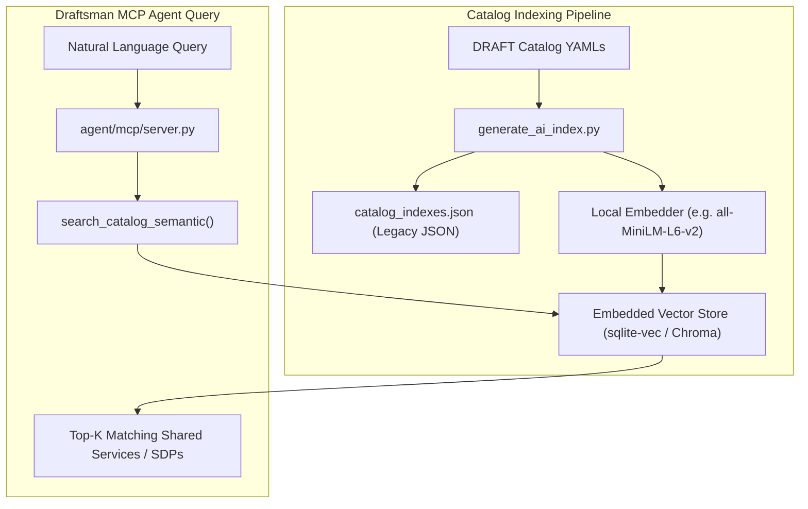

# RFC: Vector Database Integration for Semantic Index Searches

**Status**: Under Research / Feature Request  
**Target Version**: DRAFT v1.3+ / Future Enhancement  
**Authors**: DRAFT Architecture Working Group  

---

## 1. Executive Summary

As enterprise adoption of DRAFT expands across distributed repositories, catalog indices (`catalog_indexes.json`, `AI_INDEX.md`) grow to include hundreds of Software Deployment Patterns (SDPs), Shared Service IaC modules, Capability Slots, and Requirement Groups.

Currently, index retrieval in `agent/mcp/indexes.py` relies on exact string match, structural filter parameters, or keyword lookups. This proposal initiates research into integrating an **embedded vector database** for semantic index searches, allowing AI tools and system architects to query the catalog using high-level natural language intent (e.g., *"resilient relational database with multi-region failover"* or *"OAuth2 compliant authentication service"*).

---

## 2. Problem Statement

1. **Exact-Match Blindspots**: AI agents (Cursor, Claude Code, Antigravity, Copilot) querying catalog indexes via Draftsman MCP can miss relevant shared services if query terminology doesn't match exact YAML keys or tag names.
2. **Growing Catalog Scale**: In large organizations with decentralized Pattern 2 setups, scanning large text indices (`AI_INDEX.md`) consumes substantial token context.
3. **Intent-Driven Composition**: When constructing an SDP, developers often describe requirements functionally. Vector similarity allows Draftsman to immediately recommend compliant `deployable` Shared Service packages without requiring developers to memorize catalog naming schemes.

---

## 3. Core Principles & Constraints

To preserve DRAFT's core architectural tenets, any vector database integration must adhere to:

* **Repo-First & Zero Mandatory Cloud Infra**: Vector indexing must function locally inside the repository or developer environment without requiring a mandatory paid external vector service (e.g. Pinecone).
* **Embedded / Zero-Dependency Fallback**: Use lightweight embedded engines (e.g., `sqlite-vec`, `duckdb`, or local `chromadb` / `fastembed`).
* **Non-Breaking / Optional Overlay**: Standard JSON (`catalog_indexes.json`) and Markdown (`AI_INDEX.md`) search must remain fully supported as fallbacks.
* **Deterministic Build Artifact**: Vector embeddings can be generated as part of `framework/tools/generate_ai_index.py` during CI/CD sync.

---

## 4. Proposed Architecture

---

## 5. Key Research Questions

1. **Embedding Model Selection**:
   * What local, open-source embedding model offers the optimal tradeoff between latency, footprint (< 100MB), and semantic retrieval quality for technical architecture specs?
2. **Vector Engine Storage**:
   * Is `sqlite-vec` or `chromadb` best suited for cross-platform Python environments (macOS, Linux, Windows)?
3. **MCP Tooling API**:
   * What tool signature should be added to `agent/mcp/server.py`?
   * *Proposed*: `search_catalog_semantic(query: str, limit: int = 5, min_score: float = 0.7, filters: dict = None)`
4. **Hybrid Search Strategy**:
   * How should vector similarity score combine with strict metadata filters (e.g., filtering for `provisioningModel: deployable` or `complianceStatus: active`)?

---

## 6. Next Steps

- [ ] Prototype local vector indexing in `agent/mcp/` using `sqlite-vec` or `fastembed`.
- [ ] Benchmark query response time and memory footprint against static JSON index lookup.
- [ ] Draft MCP tool extension specification for Draftsman integration.
