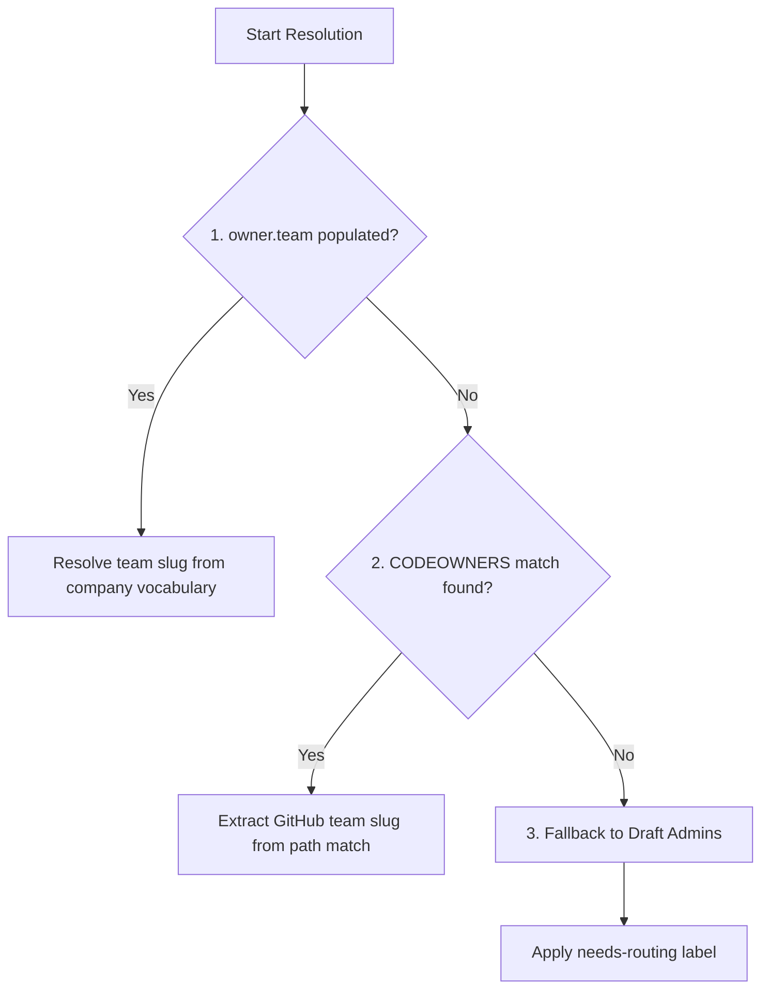
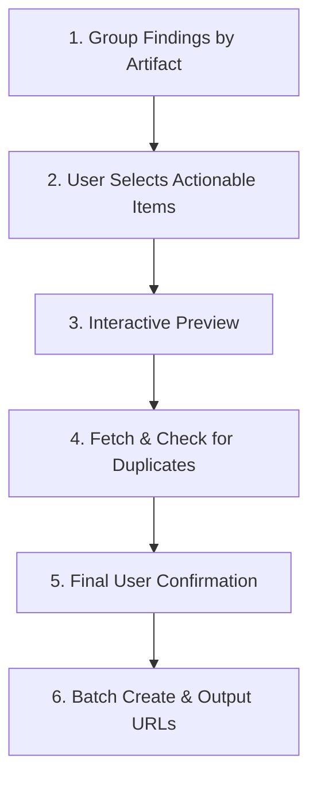

# Ticketing and Issue Creation Workflow

> **Audience:** Draft Admins, Shared Services, and Engineering Representatives.
> This guide defines how DRAFT-created GitHub issues are structured, routed, and managed.
> It ensures that validation findings and content review feedback are consistently turned into
> actionable, trackable items for accountable teams.

DRAFT is a repo-first, automation-friendly framework. To scale collaboration, the Draftsman automatically
bridges catalog analysis (validation and manual content review) with the company’s engineering workflows via
GitHub Issues.

This document serves as the authoritative specification for how the Draftsman and workspace automation:
1. Normalize and format issue titles and bodies.
2. Embed machine-readable YAML metadata to prevent duplicates and enable downstream automation.
3. Manage the interactive user experience (UX) during issue generation.
4. Route issues to accountable teams, even when ownership is missing.

---

## 1. Issue Title Format

Issue titles must be concise, readable, and follow a standardized pattern so that developers can quickly scan their backlogs:

```text
[Draft] <Artifact Name>: <short action>
```

### Examples:
* `[Draft] OpenStack API Load Balancer: assign accountable owner`
* `[Draft] Keystone Database: complete encryption-at-rest evidence`
* `[Draft] OpenStack IaaS Platform: resolve invalid deployment target`

---

## 2. Issue Body Structure

DRAFT issues are hybrid documents. They are designed to be easily read by humans while containing a structured, machine-readable block that can drive automated workflows, metric boards, and auto-triage scripts.

Every DRAFT-created issue body must contain the following five sections in order:

1. **## Summary** — A single-sentence description of the requested correction or feedback.
2. **## Why This Matters** — The underlying validation rule, security/compliance control, or operational risk.
3. **## Requested Action** — The specific action expected from the assignee or accountable team.
4. **## Routing** — An explicit mention of the GitHub team and the DRAFT role involved.
5. **## Draft Metadata** — A fenced YAML block containing structured metadata.

### Example Issue Body:

```markdown
## Summary

Assign the correct accountable team owner to the OpenStack API Load Balancer network service.

## Why This Matters

Every catalog object must have a clearly assigned owner team so that security controls, patch management, and lifecycle decisions can be routed to the correct people.

## Requested Action

Update `catalog/shared-services/network-services/network-service-openstack-api-lb.yaml` to include a valid team under `owner.team` that matches the company vocabulary list.

## Routing

@my-org/network-services

This issue is routed to **network-services** for the **Shared Services** Draft role.

## Draft Metadata

```yaml
draft:
  schemaVersion: "1.0"
  source:
    kind: validation
    command: "/draft validate"
    ruleId: owner-team-required
  artifact:
    uid: 01ABC123XYZ
    name: OpenStack API Load Balancer
    type: network_service
    path: catalog/shared-services/network-services/network-service-openstack-api-lb.yaml
    catalogStatus: incomplete
  routing:
    draftRole: shared-services
    accountableTeam: network-services
    githubTeam: "@my-org/network-services"
    needsRouting: false
  classification:
    severity: normal
    labels:
      - draft
      - needs-triage
      - role:shared-services
      - severity:normal
    duplicateKey: "draft:01ABC123XYZ:validation:owner-team-required"
```
```

---

## 3. Metadata Schema Specification

The `## Draft Metadata` fenced YAML block is highly governed. It must use the following schema.

### Required Fields

```yaml
draft:
  schemaVersion: "1.0"        # The version of the metadata schema (currently "1.0")
  source:
    kind: string              # Either "validation" or "content-review"
    command: string           # The exact DRAFT command run (e.g., "/draft validate" or "/draft review")
  artifact:
    uid: string               # The unique identifier of the target object
    name: string              # The display name of the target object
    type: string              # The DRAFT object type (e.g., runtime_service, host, product_component)
    path: string              # The workspace-relative file path to the object
    catalogStatus: string     # The catalogStatus of the object (e.g., stable, incomplete, draft)
  routing:
    draftRole: string         # The DRAFT role responsible (engineering, shared-services, draft-admins)
    accountableTeam: string   # The name of the team accountable for fixing the issue
    githubTeam: string        # The @org/team-slug handle for routing
    needsRouting: boolean     # True if team assignment is missing or ambiguous and requires admin triage
  classification:
    severity: string          # The severity level: blocker, normal, or low
    labels: list[string]      # List of labels applied to the GitHub issue
    duplicateKey: string      # A deterministic, unique hash to detect existing open duplicates
```

### Optional/Context-Specific Fields

Depending on the source of the issue, the metadata block may include additional context:

```yaml
draft:
  source:
    ruleId: string            # The validator rule ID that failed (for validation findings)
    validatorMessage: string  # The raw validator message
    requirementGroup: string  # The related RequirementGroup UID (if applicable)
    requirementId: string     # The related requirement ID (if applicable)
    reviewSession: string     # The DraftingSession or review session UID (for content-review)
    evidence: string          # Specific evidence required to satisfy the finding
  artifact:
    ownerTeam: string         # The current owner.team listed in the file, if different or invalid
  routing:
    fallbackTeam: string      # The team assigned as fallback if primary owner cannot be reached
    routingReason: string     # The reason why fallback or administrative routing was applied
  classification:
    projectFields: map        # Optional key-value pairs for downstream project board automations
```

---

## 4. DRAFT Role Semantics and Labeling

DRAFT-created GitHub issues use a minimal, stable set of labels designed for high-level queue filtering and team routing. Richer metadata remains inside the machine-readable YAML block or optional project board fields.

Every issue created by a DRAFT workflow must receive these exact default labels:

* `draft` — Identifies the ticket as a DRAFT framework-generated issue.
* `needs-triage` — Indicates that the ticket is open and requires action.
* Exactly one **Draft Role** label (defined below).
* Exactly one **Severity** label:
  - `severity:blocking` (for blocker validation failures)
  - `severity:normal` (for normal validation warnings or manual review items)
* Exactly one conditional label (if applicable):
  - `needs-routing` (applied only when the accountable GitHub team cannot be programmatically resolved).

### Canonical DRAFT Roles

Draft role labels identify the ownership layer/catalog tier, not the specific individual or team responsible for the work. There are three canonical roles:

1. **role:engineering** — Product/application tier. Responsible for ProductComponents, DataComponents, and SoftwareDeploymentPatterns.
2. **role:shared-services** — Shared infrastructure tier. Responsible for Hosts, RuntimeServices, DataStoreServices, NetworkServices, TechnologyComponents, and shared DecisionRecords.
3. **role:draft-admins** — Governance tier. Responsible for workspace configuration (`.draft/workspace.yaml`), company vocabulary lists, active RequirementGroups, ReferenceArchitectures, framework updates, and catalog governance rules.

> [!NOTE]
> The concrete accountable team is separate from the DRAFT role. A single DRAFT role (like `role:engineering` or `role:shared-services`) will have many different concrete teams assigned (e.g., `billing-team`, `database-admins`, `platform-eng`).

### Excluded Labels (Non-Goals)
To prevent label sprawl and maintain clean repository filtering, the Draftsman **must not** apply default labels for:
* Object type (`type:runtime_service`)
* Artifact UIDs or file paths
* Concrete team names (`team:billing`)
* Source details (`source:validation`)

---

## 5. Accountable Team Resolution Rules

When a validation failure or content review finding is detected, the Draftsman programmatically resolves the accountable GitHub team using a strict 3-tier priority sequence:



### Priority 1: Artifact Ownership
The Draftsman checks the target artifact's metadata directly:
* **Product / Infrastructure Layers:** Reads the `owner` (or `owner.team`) field inside the object's YAML file.
* **Governance Layer:** Reads the `definitionOwner` or `owner` of the capability, RequirementGroup, or configuration patch.
* **Resolution:** Cross-references the owner value against the workspace's company team vocabulary. If mapped to a GitHub team slug, that slug (e.g., `@my-org/core-infra`) is selected.

### Priority 2: CODEOWNERS & Path Fallback
If the artifact YAML has no assigned owner team, the Draftsman falls back to git-native ownership:
1. Reads the workspace `.github/CODEOWNERS` file.
2. Evaluates the artifact's file path (e.g. `catalog/engineering/core/product-api.yaml`) against the rules.
3. Finds the most specific matching path rule (e.g. `catalog/engineering/core/   @my-org/core-devs`).
4. Extracts that GitHub team slug as the accountable team.

### Priority 3: Draft Admin Fallback (`needs-routing`)
If the owner team cannot be resolved via artifact metadata or `.github/CODEOWNERS`, the Draftsman:
1. Assigns the issue to the workspace's configured administration team (`@my-org/draft-admins`).
2. Sets `needsRouting: true` and `routingReason: "owner.team missing or unresolved"` in the YAML metadata.
3. Applies the conditional `needs-routing` GitHub label.
4. Alerts the user and routes the ticket to the Draft Admins triage queue.

---

## 6. Deterministic Duplicate Detection

To prevent spamming the repository with duplicate issues for the same recurring validator failures or review comments, the Draftsman computes a deterministic `duplicateKey`:

```text
draft:<artifact.uid>:<source.kind>:<rule-id-or-feedback-hash>
```

### UX Behavior:
1. When preparing an issue, the Draftsman fetches currently open issues in the repository.
2. It parses their metadata blocks to find any matching `duplicateKey`.
3. If an open issue with the same `duplicateKey` already exists, the Draftsman:
   * **Filters it out** of the active creation list.
   * Informs the user: *"An active issue for this finding already exists: #123."*
   * Optionally offers to add a comment or update the existing issue if new evidence is present.

---

## 7. Interactive Issue UX Protocol

The ticketing workflow is an interactive sub-action embedded in both `/draft validate` and `/draft review`. The Draftsman must follow this 6-step protocol:



### Step-by-Step UX Flow:

1. **Group & Summarize:** Group all detected failures, warnings, or review comments by their target artifact. Never show raw CLI errors. Present them in clean, styled tables.
2. **Select Actionable Items:** Ask the user which findings they would like to track in GitHub:
   ```text
   The following validation warnings were found. Which should we turn into GitHub issues?
   [x] 1. OpenStack API Load Balancer: Missing accountable owner (Shared Services)
   [x] 2. Keystone Database: Encryption at rest missing evidence (Shared Services)
   [ ] 3. Platform Audit Schema: Duplicate requirement implementation (Engineering)
   ```
3. **Interactive Preview:** For the selected items, show a quick preview of the titles, labels, and the team to be pinged.
4. **Duplicate Verification:** Query the GitHub API for existing issues containing the same `duplicateKey` values. Exclude duplicates and print warnings for any matches.
5. **Final Confirmation:** Ask a single, final confirmation question:
   > Create 2 GitHub issues for the selected findings? (yes / no)
6. **Batch Creation:** Create the issues concurrently using `gh issue create`. Once complete, print a bulleted list of clickable URLs for the user to review.

---

## 8. Falling Back When Ownership is Missing

When an artifact fails validation because its `owner.team` is missing, invalid, or cannot be resolved, the Draftsman cannot route the issue to an engineering team. 

In this scenario, DRAFT enforces **admin-first fallback**:

* **Accountable Role:** Routed to the `Draft Admins` role.
* **accountableTeam:** `draft-admins`
* **githubTeam:** `@my-org/draft-admins` (or the configured workspace admin team handle)
* **needsRouting:** `true`
* **routingReason:** `"owner.team missing or unresolved"`

The Draft Admins team will triage the issue, identify the correct team, and update the catalog or route the ticket manually. This ensures that gaps are kept visible and are governed directly by workspace administrators.

---

## 9. Customization and Downstream Overrides

### Overriding Default Labels
While DRAFT enforces a stable set of default labels, workspace administrators can configure overrides in `.draft/workspace.yaml` under a `ticketing` configuration block:

```yaml
ticketing:
  labelOverrides:
    draft: "draft-catalog"
    needs-triage: "status:needs-triage"
  additionalLabels:
    - "env:production"
```

### Downstream Integrations (Jira, Slack, Projects)
Downstream workflows (e.g., synchronizing issues to Jira, alerting Slack channels, or placing tickets on a GitHub Project board) should not be implemented directly in the Draftsman CLI. Instead, they should be driven by downstream GitHub Webhooks or Actions that parse the structured `## Draft Metadata` YAML block inside the issue body.

For example, a GitHub Action can parse the YAML and automatically:
* Move the issue to the GitHub Project column corresponding to `draft.routing.draftRole`.
* Populate a custom dropdown field for `accountableTeam`.
* Sync the issue to the Jira project mapped to the resolved `githubTeam` handle.

